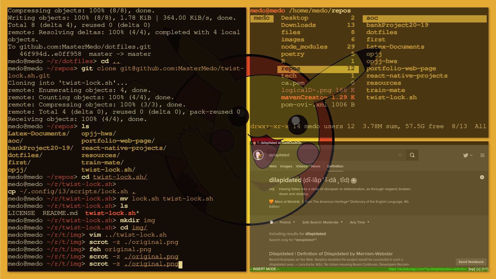
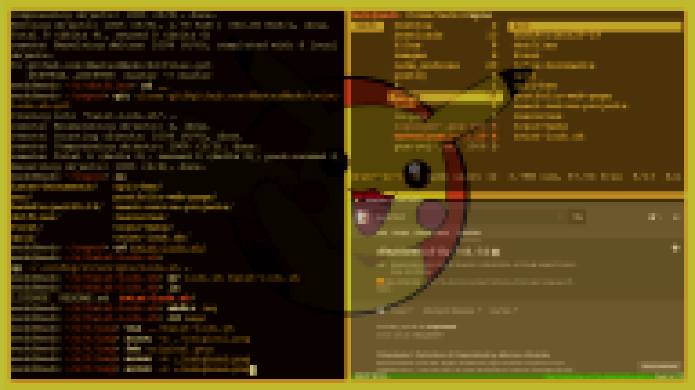
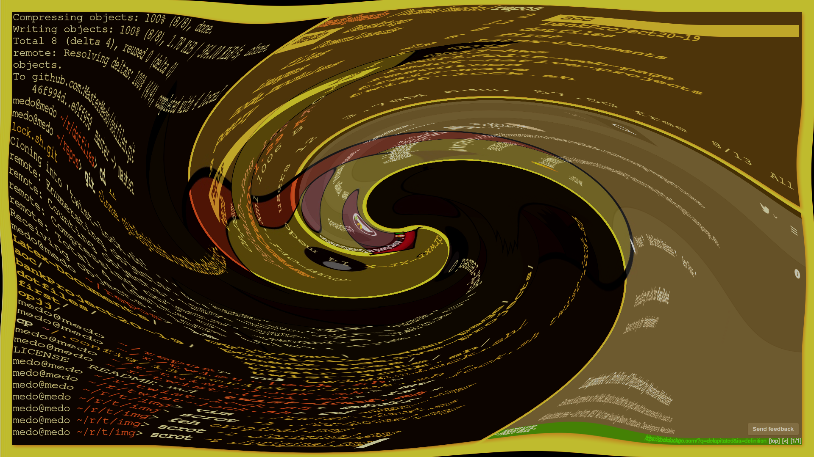
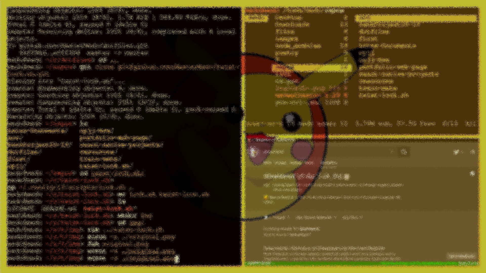

# twist-lock.sh

1. takes a screenshot of your screen
2. applies a certain transformation on the image
3. starts i3 lock with the created image

## current features

### original

### blur

### pixelate

###	swirl

### spread

### problems
- It's slow, very slow, for now at least. max: ~900ms to lock the screen, depends on the effect
- Has no visual input for typing the password, if you mess up it's faster to spam backspace than to wait for the cooldown
