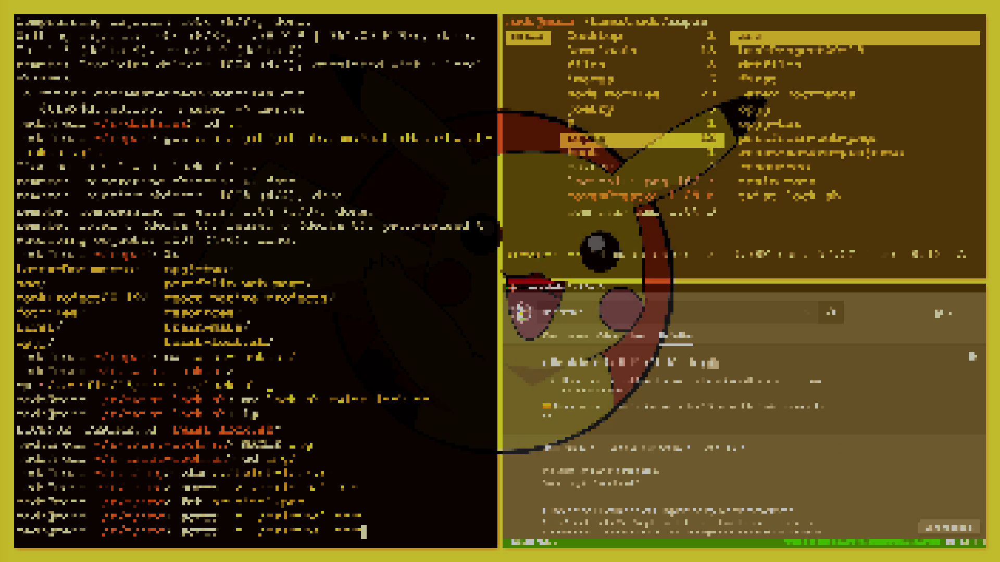

# twist-lock.sh

1. takes a screenshot of your screen
2. applies a certain transformation on the image
3. starts i3 lock with the created image

## effects ordered by speed

### original

### sample 0.523 sec

### pixelate 0.541 sec

### spread 1.347 sec

###	swirl 1.366 sec

### blur 1.664 sec

### info
- only two fast effects atm
- read man pages for each command
